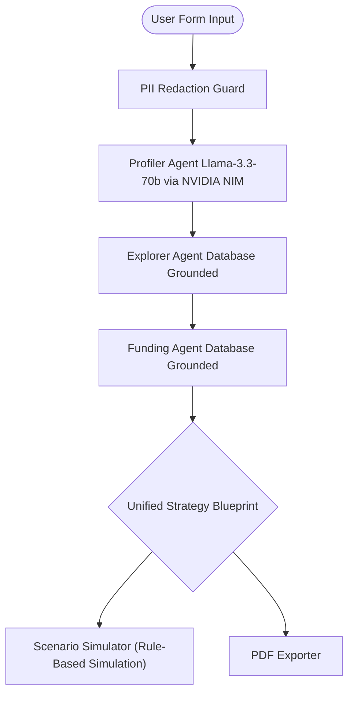

# AgentBridge — Multi-Agent Global Career & Migration Planner

> **Note**: This project is a working prototype built as part of the **Kaggle 5-Day AI Agents Capstone**. It is designed to demonstrate multi-agent orchestration, PII redaction security guards, database grounding, and pathway simulation.

AgentBridge is a prototype planning dashboard designed for students and professionals looking to transition their career to international destinations. It processes user academic and professional goals, extracts profile metrics, performs grounded database matching across exactly five target countries, and models career progression outcomes comparing stay-in-home-country versus migration options.

---

## 🚀 Features

* **PII Guard Redaction**: A local pattern-matching security utility that sanitizes sensitive details (names, email addresses, phone numbers, and SSNs/IDs) in candidate input before forwarding data to external LLMs.
* **Profiler Agent**: Evaluates user resumes and goals to suggest target roles, identify critical skill gaps, and estimate global employability indexes using LLMs via NVIDIA NIM.
* **Explorer Agent**: A database-grounded agent that evaluates compatibility matching across exactly 5 pre-seeded target countries: Japan (JP), Germany (DE), Canada (CA), Australia (AU), and the Netherlands (NL).
* **Funding Agent**: Performs a cost calculation analysis (tuition, living costs, visa fees) and recommends matching scholarship opportunities from a pre-seeded local database.
* **Scenario Simulator**: A rule-based scenario builder that models career pathways comparing stay-in-India vs. migration scenarios (JP, DE, CA) using simulated salary and timeline metrics.
* **Report Exporter**: Assembles the generated strategy blueprint data into a formatted PDF document download featuring a professional cover page and branding.

---

## 🛠️ Tech Stack

* **Backend**: FastAPI (Python 3.10+)
* **LLM Orchestration**: Google ADK (Agent Development Kit), NVIDIA NIM API (Meta Llama-3.3-70b-instruct model)
* **Database**: SQLite3 (pre-seeded relational grounding for country details, scholarships, and careers)
* **Frontend**: HTML5, Vanilla CSS, Vanilla JavaScript (featuring Lucide Icons and tab-based state management)
* **PDF Engine**: fpdf2 (dynamic document generation with custom layout template)

---

## 📊 System Architecture

AgentBridge coordinates specialized agents sequentially to compile candidate strategies:



---

## 📂 Project Structure

```
AgentBridge/
├── .gitignore               # Git ignore rules for virtual environments, DBs, logs, and PDFs
├── LICENSE                  # MIT License
├── README.md                # Project documentation
├── Run AgentBridge.bat      # Windows launcher script (auto-creates venv, installs deps, starts server)
├── Stop AgentBridge.bat     # Windows script to stop uvicorn server running on port 8000
│
├── backend/                 # Backend FastAPI application
│   ├── agents.py            # AI agent pipeline using Google ADK & NVIDIA NIM
│   ├── database.py          # SQLite database connection, schema setup, and auto-seeding
│   ├── main.py              # FastAPI endpoints, CORS, static mounting, and uvicorn runner
│   ├── report_generator.py  # PDF strategy blueprint exporter
│   ├── requirements.txt     # Python package dependencies
│   └── simulator.py         # Rule-based stay-vs-migration scenario planner
│
└── frontend/                # Frontend user interface
    ├── app.js               # Application logic, count-up animations, and API requests
    ├── index.html           # Main dashboard structure and layout
    ├── style.css            # Responsive layout styling and animations
    └── assets/              # UI Assets
        ├── background.jpg   # Hero section background
        └── logo.jpg         # Application logo
```

---

## ⚙️ Installation & Setup

### 1. Clone the Repository
Place the repository files inside your workspace directory.

### 2. Configure the Environment
Create a `.env` file in the `backend/` directory with the following variables:
```env
NVIDIA_API_KEY=your_nvidia_nim_api_key_here
GEMINI_API_KEY=your_gemini_api_key_here
```

### 3. Install Dependencies & Start the Application
#### Windows Launcher (Recommended)
Double-click `Run AgentBridge.bat` in the root folder.
This script will:
* Check for `backend/.env` configuration.
* Set up a Python virtual environment (`.venv`) inside the `backend` folder.
* Install all required dependencies from `backend/requirements.txt`.
* Auto-launch the backend FastAPI server and open `http://127.0.0.1:8000` in your default browser.

#### Manual Startup
To run manually, navigate to the `backend/` directory:
1. Initialize virtual environment and activate it:
   ```bash
   python -m venv .venv
   source .venv/bin/activate  # On Windows: .venv\Scripts\activate
   ```
2. Install python packages:
   ```bash
   pip install -r requirements.txt
   ```
3. Initialize the database schema and seed data:
   ```bash
   python database.py
   ```
4. Start the FastAPI server:
   ```bash
   python main.py
   ```
   Open your browser and navigate to `http://127.0.0.1:8000/`.

---

## 📸 Prototype Interface

Here are placeholders for screenshots of the running application interface:

* **Landing Page**: Immersive themed dashboard showing the application workflow, core conceptual modules, and system metrics.
  

* **Intake Form**: Simple form requesting target degree level, resume text, and career objectives.
  

* **Blueprint Dashboard**: Tabbed interface displaying the target career profile analysis, country comparison tables, scholarship listings, and a generated milestone timeline.
  

---

## 🔮 Future Improvements

* **Live Multi-Agent Chat**: Real-time interactive session with specialized agents advising on specific countries.
* **Real-time Cost Feed**: Connecting to currency exchange APIs and official university cost APIs.
* **Expanded Country Support**: Adding visa structures for countries such as the UK, US, and Singapore.
* **Expanded PII Guard Rules**: Dynamic, user-customizable security settings.

---

## 📄 License

This project is licensed under the MIT License - see the [LICENSE](LICENSE) file for details.

---

## 🎓 Capstone Attribution

This project was built for the **Kaggle 5-Day AI Agents Capstone**, focusing on building production-grade multi-agent architectures, function calling validation, security guards, database grounding, and scenario simulation.
